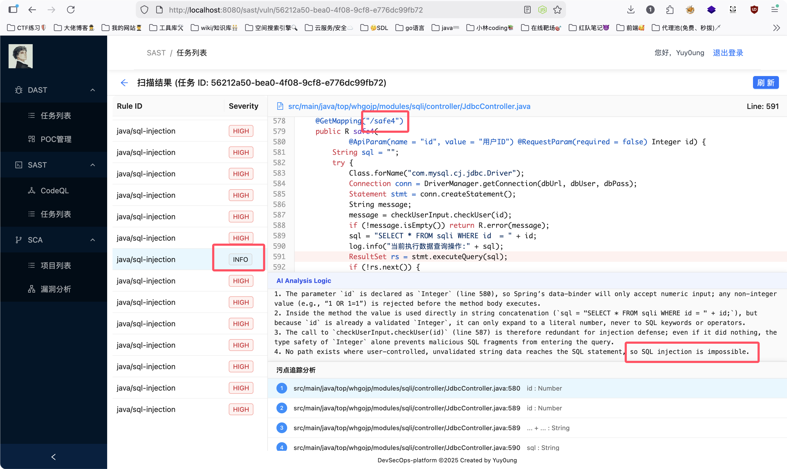

# DevSecOps平台demo

作者在学习SDL过程中，为了实践一下，更加了解建设的思路，于是有了此项目

## 设计

### 平台架构

* 后端使用go + gin + gorm + go-redis
* 前端vue + ant-design + axios
* 任务调度使用redis，数据库使用mysql

### DAST模块

IP+测活+端口扫描+POC检测

考虑到开发效率问题，暂时以现成的工具做实现：

* http测活自写规则，httpx的sdk不成熟变化太快

* 针对IP做端口扫描，naabu很不错，projectdiscovery的项目，在go的库中也有sdk
* 没有比较好的指纹规则，暂时没写指纹
* poc用nuclei，比较好找poc，也有稳定的go的SDK

由于没有考虑自主实现公司场景的API网管模拟，所以没有做基于流量的被动扫描相关功能

### SAST模块

* 静态扫描器选择使用的CodeQL
* 扫描目标为git仓库和自主上传已构建的数据库两种
* 规则采用的官方CWE+自主编写增量规则
* 平台前后端基于扫描结果实现代码、污点的预览，优化使用体验

### SCA模块

开发中......

## 功能预览

### 登陆校验

账号/密码默认为：

* Yuy0ung
* Yuy0ung@test123

### DAST模块

任务列表：

扫描结果：

### SAST模块

扫描选项配置：

任务列表：

扫描结果+代码预览+污点追踪：

#### AI审计功能

扫描时可以选择开启AI审核功能：

开启后AI会自动对扫描出的漏洞进行复核，可能会明显增加耗时

AI审计会自动标记误报，降低误报率：

### SCA模块

开发中......

## ToDoList

- [x] 基本设计
- [x] DAST模块开发
- [x] SAST模块开发
- [ ] SCA模块开发
- [x] 任务队列
- [x] 数据整理
- [x] 前端设计
- [x] 权限校验
- [ ] 复杂功能、自由度
- [ ] 分布式

## 配置

~~~sh
sudo apt install redis-server -y

go install -v github.com/projectdiscovery/nuclei/v3/cmd/nuclei@latest

go mod tidy

#配置AI的API KEY
export LLM_API_KEY="模型API key"
export LLM_API_URL="模型调用API URL"
export LLM_MODEL="模型名称" 

export CGO_ENABLED=1 CC=gcc 
export CGO_CFLAGS="-I/usr/include/pcap" 
export CGO_LDFLAGS="-lpcap" 
go run main.go
~~~

前端/Nginx配置：

~~~sh
vim /etc/nginx/sites-available/spa
sudo tee /etc/nginx/sites-available/spa > /dev/null <<'EOF'
server {
    listen 80;
    server_name _;

    root /var/www/html;
    index index.html;

    access_log /var/log/nginx/spa.access.log;
    error_log  /var/log/nginx/spa.error.log warn;

    # 优先代理后端 API（如果你的后端地址不同请修改 proxy_pass）
    location /api/ {
        proxy_pass http://127.0.0.1:5003;
        proxy_set_header Host $host;
        proxy_set_header X-Real-IP $remote_addr;
        proxy_set_header X-Forwarded-For $proxy_add_x_forwarded_for;
        proxy_set_header X-Forwarded-Proto $scheme;
        proxy_http_version 1.1;
        proxy_set_header Connection "";
        add_header Cache-Control "no-store";
    }

    # SPA history fallback：若找不到静态文件则返回 index.html
    location / {
        try_files $uri $uri/ /index.html;
    }
}
EOF
sudo ln -s /etc/nginx/sites-available/spa /etc/nginx/sites-enabled/spa
sudo rm -f /etc/nginx/sites-enabled/default
sudo nginx -t
~~~

mysql：

自行在main.go中设置密码

redis：
自行在main.go中设置密码

~~~
我发现了大量的分析说明上下文不足，我的本意是这些变量流经的函数方法内容都应该被提取，比如对于变量a有方法this_is_func_a(x)，那就应该将func a(){.....}的内容一并给到AI，但似乎并没有实现：

1. 代码中出现了 `checkUserInput.checkSqlBlackList(...)` 调用，看似是一个黑名单校验函数。
2. 但仅依据函数名无法确认其内部实现，且黑名单机制本身对 SQL 注入防御能力有限（容易绕过），缺乏上下文实现细节。
3. 因此无法确认该函数能有效防御当前 SQL 注入攻击向量，属于“缺失函数实现上下文”情况。') RETURNING `id`
   2026/01/20 15:24:47 Starting AI audit for finding: java/sql-injection

1. 在代码第587行调用了 checkUserInput.checkUser(id) 对 id 进行校验，并在第588行根据返回的 message 决定是否终止执行。
2. 然而，checkUserInput.checkUser 的具体实现未给出，无法确认其是否对 SQL 注入攻击向量（如引号、注释符、联合查询等）进行了有效过滤或白名单校验。
3. 由于缺失函数实现上下文，无法验证其能否防御 java/sql-injection 漏洞。

1. 在 `special1OrderBy` 方法的 `writeList` 分支中，调用了 `checkUserInput.checkSqlWhiteList(field)` 对 `field` 参数进行白名单校验。
2. 该函数名明确暗示了对 SQL 相关输入的白名单校验，且注释也指出“通常防御 order by 注入需要使用白名单的方式”，符合针对 ORDER BY 注入的防护意图。
3. 虽然无法看到 `checkSqlWhiteList` 的具体实现，但其命名、上下文用途及注释均表明这是一个用于防御 SQL 注入（特别是 ORDER BY 场景）的白名单校验函数，且被实际调用，应视为有效净化/校验机制。'

1. 在 `special2Like` 方法中，当 `type="raw"` 时，直接将 `keyword` 拼接到 SQL 语句中，未使用任何净化、校验或白名单函数。
2. 未发现任何针对 `keyword` 参数的净化、校验或白名单函数。
3. 因此判定为真阳性。') RETURNING `id`
   2026/01/20 15:25:31 Starting AI audit for finding: java/sql-injection
   
1. 在代码中发现了 `isTrustedScript(payload, trustedScripts)` 函数调用，该函数用于校验用户输入的 payload 是否在预定义的可信脚本列表中。
2. 该函数通过白名单方式限制用户输入，仅允许执行预定义的安全脚本（如 `"id".execute()`、`"ls".execute()`、`"whoami".execute()`），从而防止任意 Groovy 脚本执行。
3. 虽然未看到 `isTrustedScript` 的具体实现，但从逻辑上看，这是一个典型的白名单校验机制，且调用方式合理，能够有效防御 Groovy 注入攻击。
4. 因此，该漏洞为误报。') RETURNING `id`
~~~

