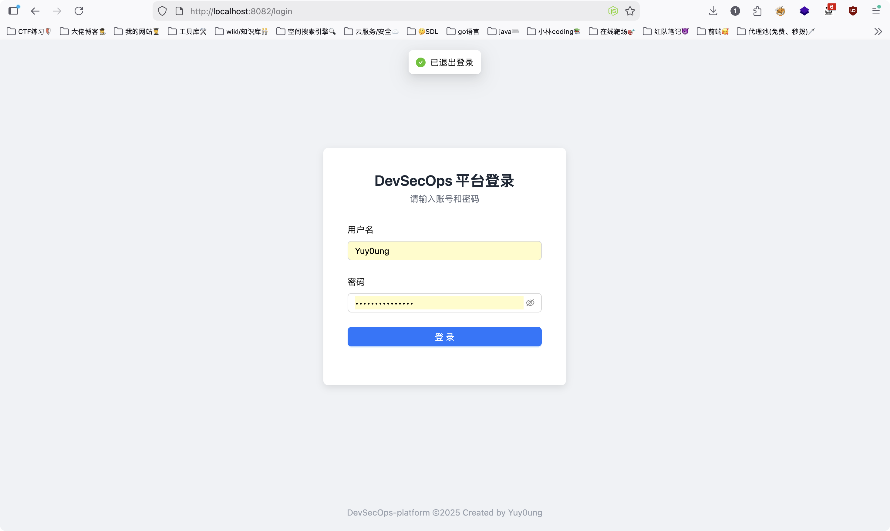
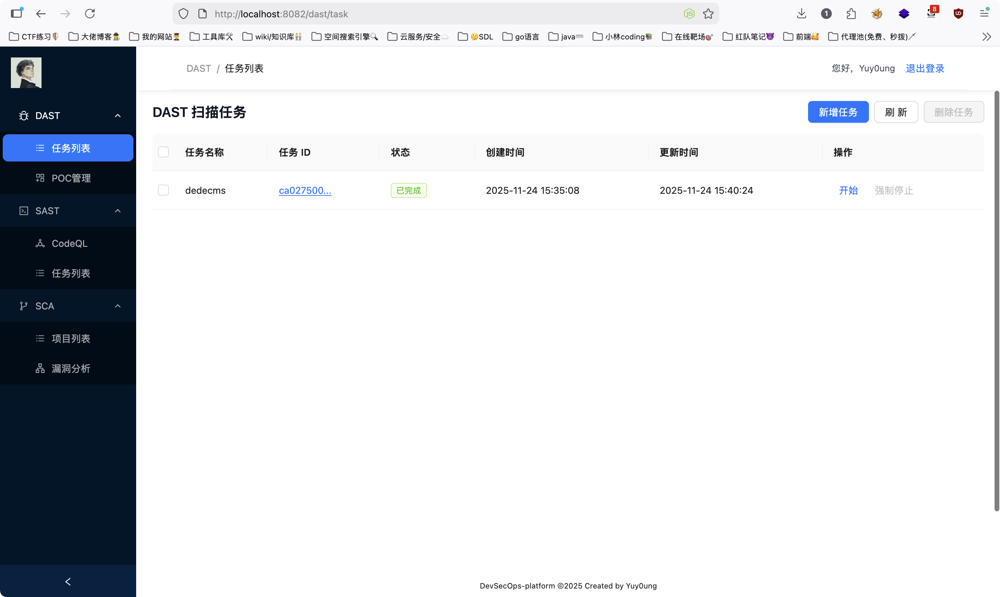
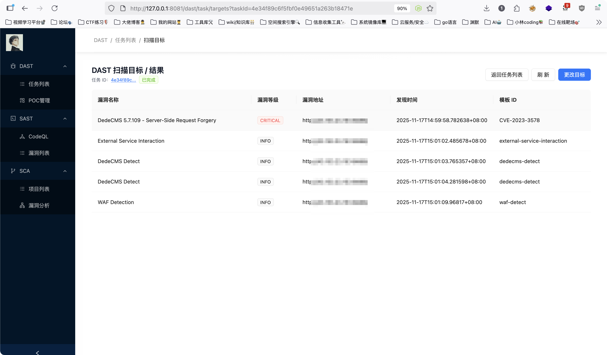
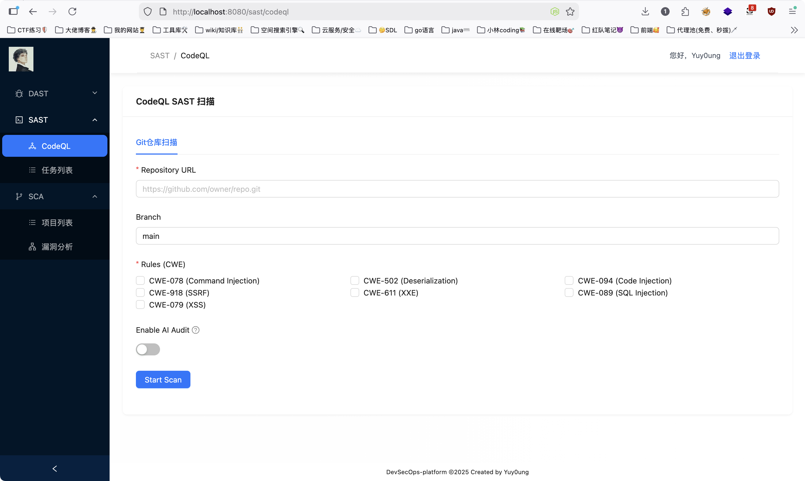
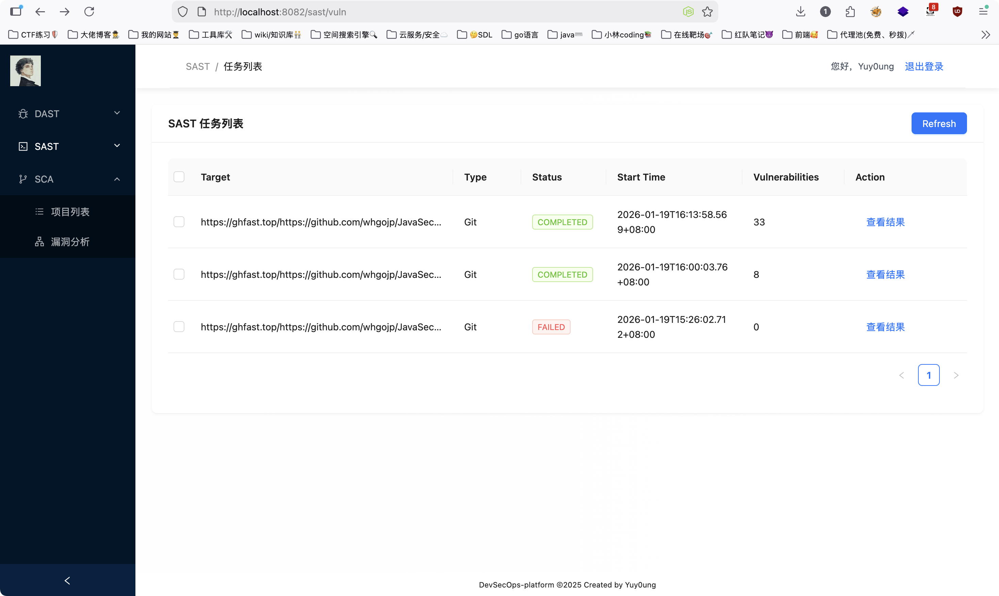
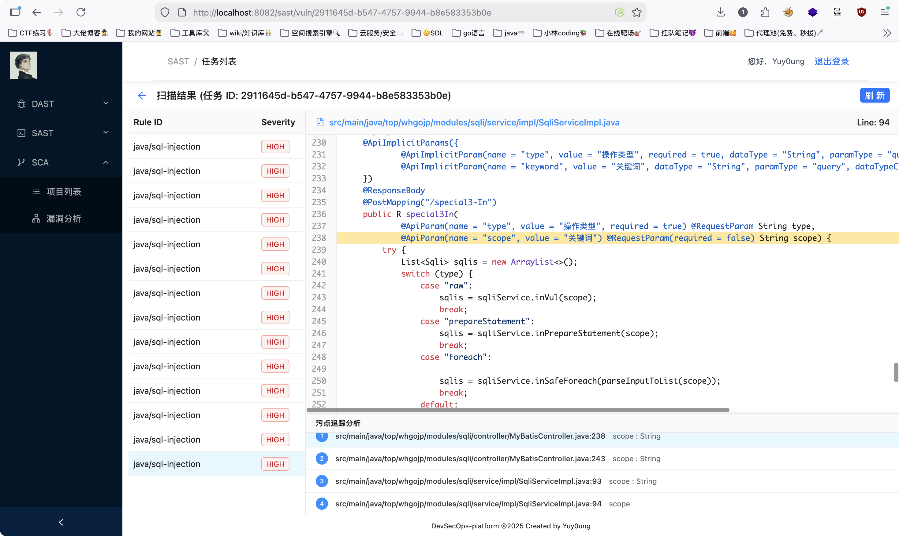
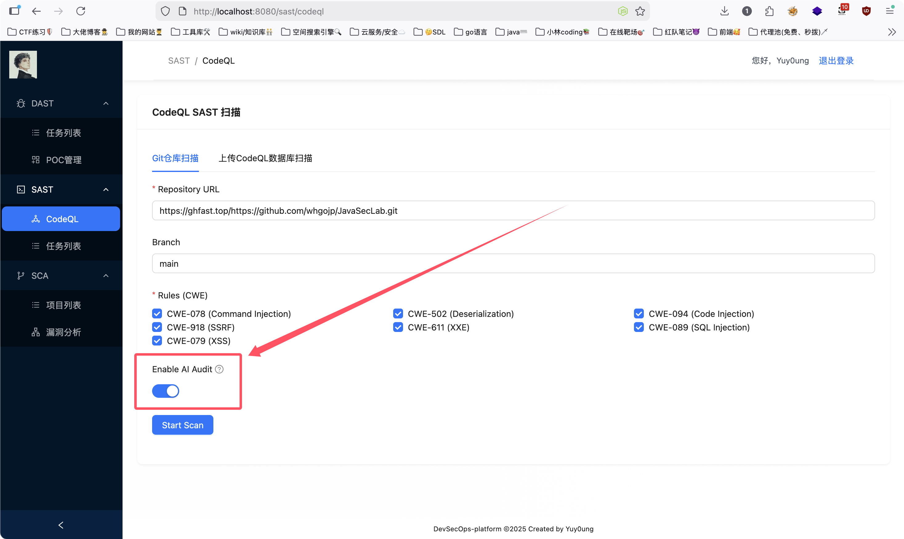
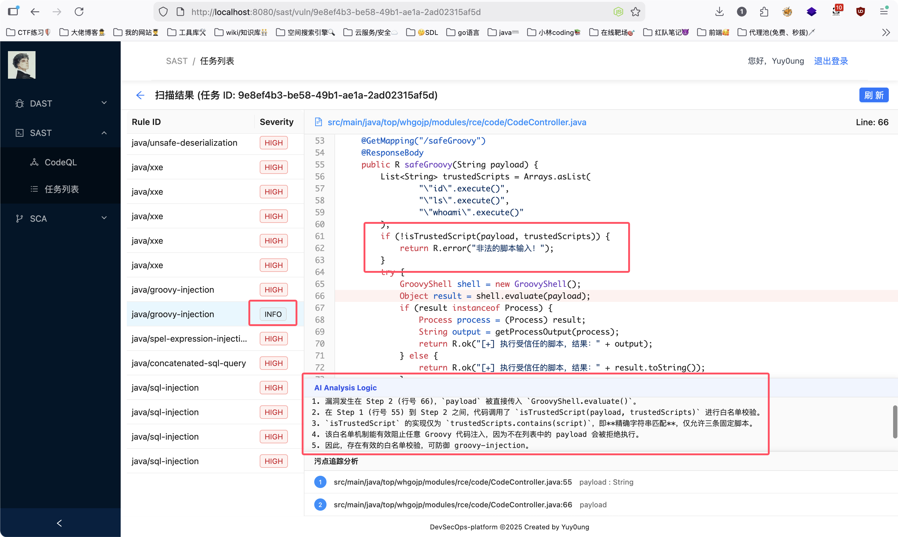

# DevSecOps平台demo

作者是某厂应用安全岗的实习生，学习SDL过程中，为了实践一下所学知识，更加了解应用安全建设的思路，于是有了此项目

该项目有SAST、DAST、SCA三个模块，其他的（IAST、RASP）由于没有落地场景就暂时未考虑，后期可能会考虑实现

目前已完成SAST、DAST模块的初步开发，SAST模块已实现AI赋能

## 设计

### 平台架构

* 后端使用go + gin + gorm + go-redis
* 前端vue + ant-design + axios
* 任务调度使用redis，数据库使用mysql

### DAST模块

IP+测活+端口扫描+POC检测

考虑到开发效率问题，暂时以现成的工具做实现：

* http测活自写规则，httpx的sdk不成熟变化太快

* 使用naabu针对IP做端口扫描，在go的库中有sdk
* 没有找到比较好的指纹规则，暂时没写指纹模块
* poc引擎使用nuclei，比较好找poc，也有稳定的go的SDK

由于没有考虑自主实现公司场景的API网管模拟，所以没有做基于流量的被动扫描相关功能的落地

### SAST模块

* 静态扫描器选择使用的CodeQL
* 扫描目标为自主设置git仓库链接
* 规则采用的官方CWE+自主编写增量规则
* 平台前后端基于扫描结果实现代码、污点的预览，优化使用体验
* 扫描配置可开启AI审核，降低误报率

### SCA模块

开发中......

## 功能预览

### 登陆校验

账号/密码默认为：

* Yuy0ung
* Yuy0ung@test123

### DAST模块

任务列表：

扫描结果：

### SAST模块

扫描选项配置：

任务列表：

扫描结果+代码预览+污点追踪：

#### AI审计功能

扫描时可以选择开启AI审核功能：

开启后AI会自动对扫描出的漏洞进行复核，可能会明显增加耗时

AI审计会自动标记误报，降低误报率：

### SCA模块

开发中......

## ToDoList

- [x] 基本设计
- [x] DAST模块开发
- [x] SAST模块开发
- [ ] SCA模块开发
- [x] 任务队列
- [x] 数据整理
- [x] 前端设计
- [x] 权限校验
- [ ] 复杂功能、自由度
- [ ] DAST分布式
- [x] SAST分布式

## 配置

~~~sh
sudo apt install redis-server -y

go install -v github.com/projectdiscovery/nuclei/v3/cmd/nuclei@latest

go mod tidy

#配置AI的API KEY
export LLM_API_KEY="模型API key"
export LLM_API_URL="模型调用API URL"
export LLM_MODEL="模型名称" 

export CGO_ENABLED=1 CC=gcc 
export CGO_CFLAGS="-I/usr/include/pcap" 
export CGO_LDFLAGS="-lpcap" 
go run main.go
~~~

前端/Nginx配置：

~~~sh
vim /etc/nginx/sites-available/spa
sudo tee /etc/nginx/sites-available/spa > /dev/null <<'EOF'
server {
    listen 80;
    server_name _;

    root /var/www/html;
    index index.html;

    access_log /var/log/nginx/spa.access.log;
    error_log  /var/log/nginx/spa.error.log warn;

    # 优先代理后端 API（如果你的后端地址不同请修改 proxy_pass）
    location /api/ {
        proxy_pass http://127.0.0.1:5003;
        proxy_set_header Host $host;
        proxy_set_header X-Real-IP $remote_addr;
        proxy_set_header X-Forwarded-For $proxy_add_x_forwarded_for;
        proxy_set_header X-Forwarded-Proto $scheme;
        proxy_http_version 1.1;
        proxy_set_header Connection "";
        add_header Cache-Control "no-store";
    }

    # SPA history fallback：若找不到静态文件则返回 index.html
    location / {
        try_files $uri $uri/ /index.html;
    }
}
EOF
sudo ln -s /etc/nginx/sites-available/spa /etc/nginx/sites-enabled/spa
sudo rm -f /etc/nginx/sites-enabled/default
sudo nginx -t
~~~

mysql：

自行在main.go中设置密码

redis：
自行在main.go中设置密码

